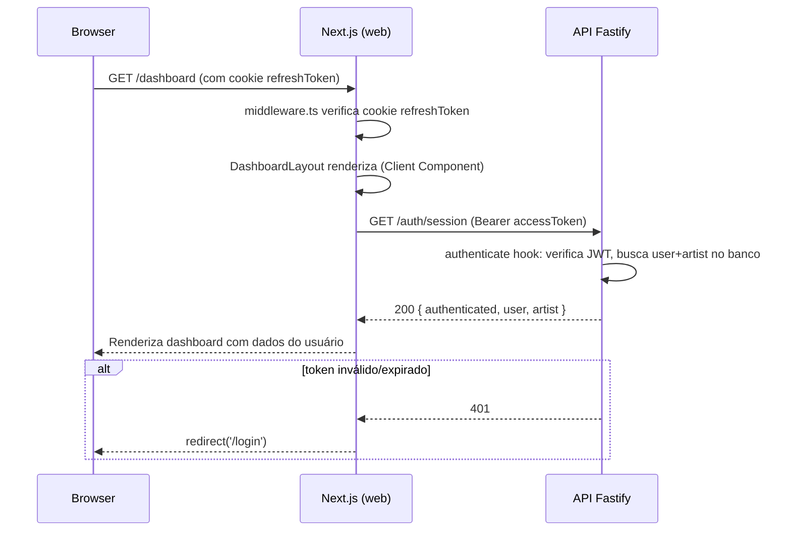
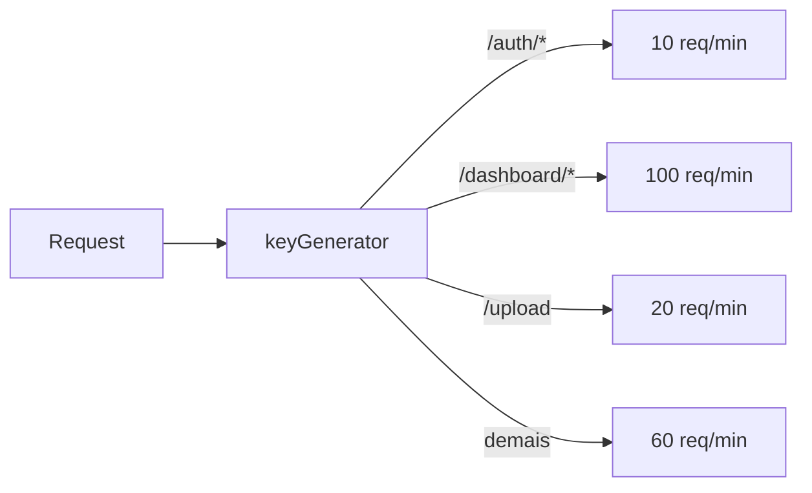

# Design Document — hub-art-corrections

## Overview

Este documento descreve as decisões técnicas para implementar as correções e melhorias definidas em `requirements.md`. O escopo cobre 14 requisitos distribuídos em três categorias:

1. **Configuração e nomenclatura** (Req 1, 2, 3, 8, 13, 14) — alterações em `package.json`, `.env.example`, `README.md`, scripts e estrutura de diretórios.
2. **API Fastify** (Req 4, 6, 9, 12) — rate limit por grupo, expansão do `GET /auth/session`, endpoints PATCH/DELETE para projetos, e campos completos no `profile.repository`.
3. **Frontend Next.js** (Req 5, 6, 7, 10, 11) — migração do dashboard para `apiClient`, correção de `sort_order`, tipos compartilhados, documentação de segurança.

A arquitetura Fastify-first é preservada integralmente. Nenhuma regra de negócio é movida para `apps/web`. Todas as mudanças são cirúrgicas e limitadas ao escopo de cada requisito.

---

## Architecture

O monorepo mantém sua estrutura atual sem alterações estruturais:

```
hub-art/                        ← package.json: name = "hub-art"
├── apps/
│   ├── api/                    ← @hub-art/api  (Fastify + Prisma + Zod)
│   └── web/                    ← @hub-art/web  (Next.js 14, apenas UI)
└── packages/
    └── types/                  ← @hub-art/types (tipos compartilhados)
```

### Fluxo de autenticação do dashboard (após Req 6)



### Rate limit por grupo (após Req 4)



---

## Components and Interfaces

### 1. `apps/api/src/plugins/rateLimit.ts` — Rate limit por grupo

O plugin atual aplica um limite global de 10 req/min. A correção usa `keyGenerator` para retornar uma chave composta de `IP + grupo`, onde o grupo é determinado pelo path da requisição. O `@fastify/rate-limit` suporta múltiplas instâncias via `routeConfig` ou um único plugin com `keyGenerator` dinâmico.

**Abordagem escolhida:** Um único plugin com `keyGenerator` que incorpora o grupo no prefixo da chave. Isso evita registrar múltiplas instâncias do plugin e mantém a configuração centralizada em um único arquivo.

```typescript
// Mapeamento path → limite
function resolveLimit(url: string): number {
  if (url.startsWith('/auth/'))       return 10
  if (url.startsWith('/dashboard/'))  return 100
  if (url === '/upload')              return 20
  return 60
}
```

A função `resolveLimit` é exportada para permitir testes unitários diretos sem precisar instanciar o Fastify.

### 2. `apps/api/src/modules/auth/auth.service.ts` — Expansão de `getSession`

O `getSession` atual retorna `{ id, email, role, artistId }`. Precisa retornar `{ authenticated: true, user: { id, email, role }, artist: { id, slug } }`.

O `slug` do artista não está disponível em `UserWithAuth` (que vem de `users`). É necessário uma query adicional na tabela `artists` quando `artistId` não for null.

**Abordagem:** Adicionar query condicional no `auth.repository` para buscar `{ id, slug }` do artista, e atualizar `getSession` no service para montar o novo formato de resposta.

```typescript
// Novo tipo de retorno
export interface SessionData {
  authenticated: true
  user:   { id: string; email: string; role: string }
  artist: { id: string; slug: string } | null
}
```

O `sessionHandler` no controller repassa o objeto diretamente sem wrapper `{ data: ... }` adicional — o objeto já contém `authenticated: true` como discriminador.

### 3. `apps/api/src/modules/auth/auth.repository.ts` — `findArtistById`

Nova função para buscar `{ id, slug }` de um artista pelo seu ID:

```typescript
export async function findArtistById(id: string): Promise<{ id: string; slug: string } | null> {
  return prisma.artist.findUnique({
    where:  { id },
    select: { id: true, slug: true },
  })
}
```

### 4. `apps/api/src/modules/projects/projects.controller.ts` — PATCH e DELETE

Seguindo o padrão exato de `tracks.controller.ts`:

- `updateProjectHandler`: verifica ownership via `findById`, valida body com `UpdateProjectSchema`, chama `update` no repository.
- `deleteProjectHandler`: verifica ownership, verifica `status !== 'draft'` (retorna 422), chama `remove` no repository.

A verificação de status é feita no controller, não no repository, para manter a lógica de negócio visível e testável.

```typescript
// Regra de negócio: apenas projetos em draft podem ser deletados
if (project.status !== 'draft') {
  return reply.code(422).send({ error: 'Apenas projetos em rascunho podem ser deletados' })
}
```

O `projects.repository.ts` já possui as funções `findById` e `update`. Será adicionada apenas a função `remove`.

### 5. `apps/api/src/modules/profile/profile.repository.ts` — Campos completos no `update`

O `select` da função `update` será expandido para incluir todos os campos editáveis:

```typescript
select: {
  id:        true,
  name:      true,
  slug:      true,
  tagline:   true,
  bio:       true,
  location:  true,
  reach:     true,
  email:     true,
  whatsapp:  true,
  skills:    true,
  tools:     true,
  isActive:  true,
  updatedAt: true,
}
```

### 6. `apps/web/src/app/dashboard/layout.tsx` — Migração para Client Component

O `layout.tsx` atual é um Server Component que usa `supabase.auth.getUser()`. Como o `accessToken` é armazenado em memória no cliente (não em cookie), a verificação de sessão deve ocorrer no cliente.

**Abordagem:** Converter para Client Component com `'use client'`. O componente chama `apiGet('/auth/session')` no `useEffect` e redireciona para `/login` se receber 401 (o `apiClient` já trata 401 com `redirectToLogin()`).

O `DashboardNav` permanece como está — não precisa de alteração.

```typescript
'use client'
// Usa apiGet('/auth/session') no useEffect
// Redireciona para /login se 401 (tratado pelo apiClient)
// Renderiza children após confirmar sessão válida
```

### 7. `apps/web/src/app/dashboard/page.tsx` — Migração para Client Component

Segue o mesmo padrão do `layout.tsx`. Remove `createClient` e `createAdminClient`. Usa `apiGet('/auth/session')` para obter `user.email` e `user.role`.

As stats de tracks são removidas da página inicial do dashboard (eram buscadas via `createAdminClient` diretamente no banco — não há endpoint equivalente no escopo deste spec). A página exibe apenas os cards de navegação com os dados do usuário vindos da sessão.

### 8. `apps/web/src/app/api/auth/logout/route.ts` — Proxy para API Fastify

Substitui `supabase.auth.signOut()` por proxy para `POST /auth/logout` na API Fastify, seguindo o padrão do `login/route.ts`:

```typescript
// Repassa Authorization header e cookies para a API
// Limpa o cookie refreshToken na resposta
```

### 9. `apps/web/src/app/dashboard/services/page.tsx` — Correção de `sort_order`

Duas mudanças cirúrgicas:
1. Interface `Service`: renomear `sortOrder: number` → `sort_order: number`
2. Objeto `body` no `handleSave`: renomear `sortOrder: editing.sortOrder` → `sort_order: editing.sort_order`

### 10. `packages/types/src/index.ts` — Atualização de tipos

Mudanças aditivas (não quebram código existente):
- `Track.id`: `number` → `string`
- `TrackGenre`: adicionar `'outro'`
- `Project`: adicionar `status: 'draft' | 'active' | 'archived'` e `sortOrder: number`

---

## Data Models

### `SessionData` (novo formato — auth.service.ts)

```typescript
interface SessionData {
  authenticated: true
  user: {
    id:    string
    email: string
    role:  string
  }
  artist: {
    id:   string
    slug: string
  } | null
}
```

### `Track` (packages/types — corrigido)

```typescript
interface Track {
  id:         string   // era: number — corrigido para UUID string
  title:      string
  genre:      TrackGenre
  genreLabel: string
  duration:   string
  key:        string
  src:        string | null
}

type TrackGenre = 'all' | 'piano' | 'jazz' | 'ambient' | 'orquestral' | 'rock' | 'demo' | 'outro'
//                                                                                          ^^^^^^^ adicionado
```

### `Project` (packages/types — expandido)

```typescript
interface Project {
  // campos existentes mantidos sem alteração
  id:                 string
  title:              string
  description:        string
  year:               string
  platform:           ProjectPlatform
  tags:               string[]
  href:               string
  thumbnailUrl:       string | null
  spotifyId:          string | null
  featured:           boolean
  backgroundStyle:    string
  backgroundPosition: string | null
  backgroundSize:     string | null
  // campos adicionados
  status:    'draft' | 'active' | 'archived'
  sortOrder: number
}
```

### Rate limit — mapeamento path → limite

| Grupo | Prefixo | Limite |
|-------|---------|--------|
| auth | `/auth/` | 10 req/min |
| dashboard | `/dashboard/` | 100 req/min |
| upload | `/upload` | 20 req/min |
| default | (demais) | 60 req/min |

---

## Correctness Properties

*A property is a characteristic or behavior that should hold true across all valid executions of a system — essentially, a formal statement about what the system should do. Properties serve as the bridge between human-readable specifications and machine-verifiable correctness guarantees.*

### Property 1: Ausência de nomenclatura legada

*Para qualquer* arquivo de código ou configuração no repositório (excluindo `.git` e `node_modules`), o conteúdo não deve conter a string `"hub-musico"`.

**Validates: Requirements 1.7, 1.8**

---

### Property 2: Mapeamento correto de rate limit por grupo de rotas

*Para qualquer* URL de requisição, a função `resolveLimit` deve retornar exatamente o limite configurado para o grupo ao qual a URL pertence: 10 para `/auth/*`, 100 para `/dashboard/*`, 20 para `/upload`, e 60 para qualquer outro path.

**Validates: Requirements 4.1, 4.2, 4.3, 4.4**

---

### Property 3: Estrutura completa da resposta de sessão

*Para qualquer* usuário autenticado com token JWT válido, `GET /auth/session` deve retornar um objeto com a estrutura `{ authenticated: true, user: { id, email, role }, artist: { id, slug } | null }` — onde `artist` é `null` apenas para usuários sem `artistId` associado.

**Validates: Requirements 6.1**

---

### Property 4: Validação Zod de PATCH projects aceita válidos e rejeita inválidos

*Para qualquer* body parcial que satisfaça o `UpdateProjectSchema` (campos opcionais do projeto), `PATCH /dashboard/projects/:id` deve retornar 200. *Para qualquer* body que viole o schema (tipo errado, valor fora do range, campo obrigatório ausente quando presente), deve retornar 422.

**Validates: Requirements 9.3**

---

### Property 5: Ownership check para operações de escrita em projetos

*Para qualquer* projeto e qualquer artista autenticado cujo `artistId` seja diferente do `artistId` do projeto, tanto `PATCH /dashboard/projects/:id` quanto `DELETE /dashboard/projects/:id` devem retornar HTTP 403 com `{ "error": "Acesso negado" }`.

**Validates: Requirements 9.4, 9.5, 9.6**

---

### Property 6: Regra de status para DELETE de projetos

*Para qualquer* projeto com `status` igual a `'active'` ou `'archived'`, `DELETE /dashboard/projects/:id` (chamado pelo dono do projeto) deve retornar HTTP 422 com `{ "error": "Apenas projetos em rascunho podem ser deletados" }`.

**Validates: Requirements 9.8**

---

### Property 7: Completude dos campos retornados pelo profile update

*Para qualquer* artista e qualquer body de update válido, a resposta de `PATCH /dashboard/profile` deve conter todos os campos editáveis: `id`, `name`, `slug`, `tagline`, `bio`, `location`, `reach`, `email`, `whatsapp`, `skills`, `tools`, `isActive`, `updatedAt`.

**Validates: Requirements 12.1, 12.2**

---

## Error Handling

### API Fastify

| Situação | HTTP | Body |
|----------|------|------|
| Token ausente ou inválido | 401 | `{ "error": "Não autorizado" }` |
| Projeto não encontrado | 404 | `{ "error": "Projeto não encontrado" }` |
| Artista não é dono do projeto | 403 | `{ "error": "Acesso negado" }` |
| Body inválido (Zod) | 422 | `{ "error": "Dados inválidos", "details": ... }` |
| Projeto não está em draft (DELETE) | 422 | `{ "error": "Apenas projetos em rascunho podem ser deletados" }` |
| Rate limit excedido | 429 | Mensagem padrão do `@fastify/rate-limit` |

### Frontend Next.js

- `dashboard/layout.tsx`: qualquer erro de rede ou 401 do `apiClient` resulta em `redirectToLogin()` (já implementado no `apiClient`).
- `logout/route.ts`: erros de rede retornam `{ success: false, error: 'Serviço indisponível' }` com status 503, seguindo o padrão do `login/route.ts`.

---

## Testing Strategy

### Abordagem dual

- **Testes unitários/de exemplo**: verificam comportamentos específicos, casos de borda e condições de erro.
- **Testes de propriedade** (property-based): verificam propriedades universais com entradas geradas aleatoriamente.

A biblioteca de property-based testing já em uso no projeto é **fast-check** (já presente em `apps/api/devDependencies`). Cada teste de propriedade deve rodar com mínimo de 100 iterações.

### Testes de propriedade (fast-check)

Cada propriedade do design deve ser implementada como um único teste de propriedade:

**Property 1** — `apps/api/src/modules/validation.property.test.ts` (ou arquivo dedicado)
- Gera strings de caminhos de arquivo aleatórios e verifica ausência de "hub-musico"
- Tag: `Feature: hub-art-corrections, Property 1: ausência de nomenclatura legada`

**Property 2** — `apps/api/src/plugins/rateLimit.property.test.ts`
- Gera URLs aleatórias com prefixos `/auth/`, `/dashboard/`, `/upload`, e outros
- Verifica que `resolveLimit(url)` retorna o valor correto para cada grupo
- Tag: `Feature: hub-art-corrections, Property 2: mapeamento de rate limit`

**Property 3** — `apps/api/src/modules/auth/auth.service.property.test.ts`
- Gera usuários com diferentes roles e com/sem artistId
- Verifica que `getSession` retorna sempre a estrutura `{ authenticated, user, artist }`
- Tag: `Feature: hub-art-corrections, Property 3: estrutura de sessão`

**Property 4** — `apps/api/src/modules/projects/projects.controller.property.test.ts`
- Gera bodies parciais válidos e inválidos para `UpdateProjectSchema`
- Verifica que `safeParse` aceita válidos e rejeita inválidos
- Tag: `Feature: hub-art-corrections, Property 4: validação Zod de PATCH projects`

**Property 5** — `apps/api/src/modules/projects/projects.ownership.property.test.ts`
- Gera pares (projeto.artistId, token.artistId) onde os dois são diferentes
- Verifica que o controller retorna 403 para PATCH e DELETE
- Tag: `Feature: hub-art-corrections, Property 5: ownership check`

**Property 6** — `apps/api/src/modules/projects/projects.controller.property.test.ts`
- Gera projetos com status `'active'` ou `'archived'`
- Verifica que DELETE retorna 422
- Tag: `Feature: hub-art-corrections, Property 6: regra de status para DELETE`

**Property 7** — `apps/api/src/modules/profile/profile.repository.property.test.ts`
- Gera dados de artista aleatórios e chama `update` com mock do Prisma
- Verifica que todos os campos esperados estão presentes na resposta
- Tag: `Feature: hub-art-corrections, Property 7: completude de campos do profile update`

### Testes de exemplo (unitários)

- `auth.controller.test.ts`: verificar que `sessionHandler` retorna 200 com a nova estrutura para usuário com artista, e `artist: null` para usuário sem artista.
- `projects.controller.test.ts`: verificar 404 para projeto inexistente, 403 para artista errado, 422 para projeto não-draft no DELETE.
- `profile.controller.test.ts`: verificar que PATCH retorna todos os campos listados.

### Testes de integração (smoke)

- Executar `pnpm typecheck` na raiz e verificar saída sem erros fatais.
- Executar `grep -R "hub-musico" . --exclude-dir=.git --exclude-dir=node_modules` e verificar zero resultados.
- Verificar que os diretórios vazios em `apps/web/src/app/api/dashboard/` foram removidos.
