# Design Técnico — Redesign do Frontend do Marketplace

## Overview

Este documento descreve o design técnico para o redesign completo do frontend público do marketplace "Lonas SP". O objetivo é transformar a interface atual — que mistura estilos genéricos, classes Tailwind literais e tokens semânticos inconsistentes — em uma experiência premium, coesa e otimizada para SEO.

### Escopo

- **Frontend-only**: A API backend permanece inalterada. Todas as mudanças são em componentes React, estilos e configuração Next.js.
- **Stack**: Next.js 14 (App Router), Tailwind CSS 3.4, Zustand 4.5, TypeScript 5.4
- **Abordagem**: Mobile-first, tokens semânticos unificados, acessibilidade WCAG 2.1 AA

### Decisões de Design Chave

| Decisão | Escolha | Justificativa |
|---------|---------|---------------|
| Tipografia headings | Playfair Display (Google Fonts) | Serifa elegante, boa legibilidade, referência Keyly/Motta |
| Tipografia body | Inter (já no projeto) | Sans-serif limpa, já carregada no globals.css |
| Paleta de acento | #E85D2C (laranja) | Contraste forte com neutros, transmite energia e confiança |
| State management | Zustand (existente) | Já usado no cartStore, sem necessidade de nova dependência |
| Animações | CSS animations + Tailwind | Sem dependência extra (Framer Motion), respeita prefers-reduced-motion |
| Structured Data | JSON-LD inline via Next.js metadata | Padrão recomendado pelo Google, integração nativa com App Router |
| Skeleton loaders | Componentes Tailwind com animate-pulse | Sem dependência extra, padrão já conhecido |
| Toast system | Zustand store + componente React | Leve, sem dependência extra, integra com arquitetura existente |

### Problemas Atuais Identificados

1. **Inconsistência de tokens**: `ProductCard` usa tokens semânticos (`text-text-default`, `bg-bg-surface`), mas `page.tsx` usa classes literais (`text-gray-900`, `bg-gray-100`)
2. **Hero com imagem externa**: Usa URL do Unsplash diretamente (viola regra do projeto)
3. **Sem loading states**: Apenas texto "Carregando..." sem skeleton
4. **Sem SEO**: Metadata estática no layout, sem JSON-LD, sem sitemap
5. **Sem feedback de ações**: Nenhum toast ou notificação ao adicionar ao carrinho
6. **Sem breadcrumb**: Navegação hierárquica ausente
7. **Acessibilidade limitada**: Modais sem trap de foco, sem aria-labels em ícones
8. **Paleta dark no Tailwind config**: O config atual é para o tema dark do site principal (músico/tatuador), não para o marketplace

## Architecture

### Visão Geral da Arquitetura

```mermaid
graph TD
    subgraph "Next.js App Router"
        Layout["marketplace/layout.tsx<br/>(metadata, fonts, providers)"]
        Home["marketplace/page.tsx<br/>(Server Component → metadata)"]
        Product["marketplace/product/[slug]/page.tsx"]
        Category["marketplace/category/[slug]/page.tsx"]
        Cart["marketplace/cart/page.tsx"]
        Checkout["marketplace/checkout/page.tsx"]
        Sitemap["marketplace/sitemap.ts"]
    end

    subgraph "Shared Components"
        Header["MarketplaceHeader"]
        Breadcrumb["Breadcrumb"]
        Toast["ToastContainer"]
        Footer["MarketplaceFooter"]
    end

    subgraph "Feature Components"
        Hero["HeroSection"]
        ProductCard["ProductCard"]
        ProductGallery["ProductGallery"]
        SearchBar["SearchBar"]
        CategoryNav["CategoryNav"]
        Skeleton["Skeleton loaders"]
        Stepper["CheckoutStepper"]
        EmptyState["EmptyState"]
        SocialProof["SocialProofSection"]
        QuoteModal["QuoteModal"]
    end

    subgraph "State (Zustand)"
        CartStore["cartStore"]
        ToastStore["toastStore"]
    end

    subgraph "Design Tokens"
        TailwindConfig["tailwind.config.ts<br/>(marketplace tokens)"]
        GlobalCSS["marketplace/globals.css"]
    end

    Layout --> Header
    Layout --> Breadcrumb
    Layout --> Toast
    Layout --> Footer
    Home --> Hero
    Home --> SearchBar
    Home --> ProductCard
    Home --> SocialProof
    Home --> CategoryNav
    Product --> ProductGallery
    Product --> QuoteModal
    Checkout --> Stepper
```



### Estratégia de Renderização

| Página | Tipo | Justificativa |
|--------|------|---------------|
| `/marketplace` | Server Component (com client islands) | SEO: metadata dinâmica, JSON-LD LocalBusiness |
| `/marketplace/product/[slug]` | Server Component (com client islands) | SEO: metadata por produto, JSON-LD Product |
| `/marketplace/category/[slug]` | Server Component (com client islands) | SEO: metadata por categoria |
| `/marketplace/cart` | Client Component | Estado local do carrinho (Zustand persist) |
| `/marketplace/checkout` | Client Component | Formulário interativo, sem necessidade de SEO |

**Migração importante**: As páginas atualmente são 100% client components (`'use client'`). O redesign migrará home, produto e categoria para Server Components com "client islands" (componentes interativos isolados como `SearchBar`, `AddToCartButton`, `ProductGallery`). Isso permite:
- `generateMetadata()` para SEO dinâmico
- JSON-LD renderizado no servidor
- Melhor performance (menos JS no cliente)

### Estrutura de Arquivos (Novos/Modificados)

```
apps/web/src/
├── app/marketplace/
│   ├── layout.tsx              (MODIFICAR: providers, fonts, toast container)
│   ├── page.tsx                (REESCREVER: server component + client islands)
│   ├── sitemap.ts              (NOVO: sitemap dinâmico)
│   ├── product/[slug]/page.tsx (REESCREVER: server component + metadata)
│   ├── category/[slug]/page.tsx(REESCREVER: server component + metadata)
│   ├── cart/page.tsx           (MODIFICAR: redesign visual)
│   └── checkout/page.tsx       (MODIFICAR: adicionar stepper)
├── components/marketplace/
│   ├── MarketplaceHeader.tsx   (REESCREVER: sticky, blur, mobile menu, cart badge)
│   ├── MarketplaceFooter.tsx   (NOVO: footer com info da empresa)
│   ├── ProductCard.tsx         (REESCREVER: hover premium, badge, specs)
│   ├── ProductGallery.tsx      (MODIFICAR: animação de transição, placeholder SVG)
│   ├── QuoteModal.tsx          (MODIFICAR: animação, trap de foco, acessibilidade)
│   ├── PaginationControls.tsx  (MODIFICAR: visual premium)
│   ├── CategoryNav.tsx         (MODIFICAR: visual premium)
│   ├── HeroSection.tsx         (NOVO: hero premium com prova social)
│   ├── SearchBar.tsx           (NOVO: busca com debounce)
│   ├── Breadcrumb.tsx          (NOVO: navegação hierárquica)
│   ├── CheckoutStepper.tsx     (NOVO: indicador de progresso)
│   ├── EmptyState.tsx          (NOVO: estados vazios visuais)
│   ├── Toast.tsx               (NOVO: sistema de notificações)
│   ├── SocialProofSection.tsx  (NOVO: métricas + depoimentos)
│   ├── ProjectsSection.tsx     (NOVO: grid de projetos)
│   ├── SkeletonCard.tsx        (NOVO: skeleton para cards)
│   ├── SkeletonProductDetail.tsx (NOVO: skeleton para página de produto)
│   └── JsonLd.tsx              (NOVO: componente para structured data)
├── stores/
│   ├── cartStore.ts            (MANTER: sem alterações)
│   └── toastStore.ts           (NOVO: estado global de toasts)
└── lib/
    └── marketplace/
        └── api.ts              (NOVO: funções de fetch para server components)
```

## Components and Interfaces

### Design Tokens (Tailwind Config — Marketplace Override)

O marketplace precisa de uma paleta completamente diferente do site principal (que é dark/purple). A solução é usar um **CSS layer scoped** no layout do marketplace que redefine os tokens semânticos:

```typescript
// Tokens semânticos para o marketplace (adicionados ao tailwind.config.ts)
marketplace: {
  bg: {
    base: '#FFFFFF',           // Fundo principal
    surface: '#F9FAFB',        // Cards, seções alternadas
    elevated: '#FFFFFF',       // Elementos elevados (modais, dropdowns)
    muted: '#F3F4F6',          // Placeholders, disabled
    dark: '#1F2937',           // Seções de contraste (social proof)
    accent: '#E85D2C',         // Botões primários
  },
  text: {
    default: '#111827',        // Texto principal
    secondary: '#4B5563',      // Texto secundário
    muted: '#9CA3AF',          // Texto desabilitado/placeholder
    accent: '#E85D2C',         // Links, destaques
    onDark: '#FFFFFF',         // Texto sobre fundo escuro
    onAccent: '#FFFFFF',       // Texto sobre acento
  },
  border: {
    default: '#E5E7EB',        // Bordas padrão
    hover: '#D1D5DB',          // Bordas hover
    accent: '#E85D2C',         // Bordas de destaque
  }
}
```

**Abordagem de implementação**: Em vez de modificar o tailwind.config.ts global (que quebraria o site principal), o marketplace usará CSS custom properties definidas no `marketplace/layout.tsx` via uma classe wrapper `.marketplace`. Os tokens semânticos existentes (`text-text-default`, `bg-bg-surface`) serão remapeados via CSS variables dentro desse escopo.

### Interfaces de Componentes

```typescript
// === Toast System ===
interface Toast {
  id: string
  type: 'success' | 'error' | 'info'
  message: string
  duration: number // ms
}

interface ToastStore {
  toasts: Toast[]
  addToast: (toast: Omit<Toast, 'id'>) => void
  removeToast: (id: string) => void
}

// === Breadcrumb ===
interface BreadcrumbItem {
  label: string
  href?: string // undefined = item atual (não clicável)
}

interface BreadcrumbProps {
  items: BreadcrumbItem[]
}

// === Empty State ===
interface EmptyStateProps {
  icon: 'cart' | 'search' | 'category' | 'product'
  title: string
  description: string
  action?: {
    label: string
    href: string
  }
}

// === Checkout Stepper ===
type CheckoutStep = 'cart' | 'data' | 'confirmation'

interface CheckoutStepperProps {
  currentStep: CheckoutStep
  completedSteps: CheckoutStep[]
}

// === Search Bar ===
interface SearchBarProps {
  onSearch: (query: string) => void
  placeholder?: string
  categories?: Array<{ id: string; name: string; slug: string }>
  onCategorySelect?: (categoryId: string | null) => void
}

// === Skeleton ===
interface SkeletonProps {
  className?: string // Para dimensões customizadas
}

// === Social Proof ===
interface Metric {
  value: number
  suffix: string // "+", "anos", etc.
  label: string
}

interface Testimonial {
  rating: number // 1-5
  text: string
  author: string
  role: string
}

// === JSON-LD ===
interface ProductJsonLdProps {
  name: string
  description: string
  image?: string
  price?: number
  currency?: string
  availability: 'InStock' | 'OutOfStock' | 'PreOrder'
  brand: string
}

interface LocalBusinessJsonLdProps {
  name: string
  address: string
  telephone: string
  openingHours: string[]
}

interface BreadcrumbJsonLdProps {
  items: Array<{ name: string; url: string }>
}

// === Product Card (redesigned) ===
interface ProductCardProps {
  product: {
    id: string
    slug: string
    title: string
    description: string | null
    type: 'FIXED_PRICE' | 'QUOTE_ONLY'
    basePrice: number | null
    thumbnailUrl: string | null
    category?: { name: string; slug: string }
    widthCm?: number | null
    heightCm?: number | null
    material?: string | null
  }
}

// === Hero Section ===
interface HeroSectionProps {
  title: string
  subtitle: string
  ctaPrimary: { label: string; href: string }
  ctaSecondary: { label: string; href: string }
  socialProof?: { count: number; label: string }
  categories?: Array<{ id: string; name: string; slug: string }>
}

// === Marketplace Header (redesigned) ===
interface MarketplaceHeaderProps {
  cartItemCount: number
}
```

### Componente: MarketplaceHeader (Redesign)

**Comportamento**:
1. Fixo no topo (`sticky top-0 z-50`)
2. Fundo transparente no topo → `backdrop-blur-md bg-white/80 shadow-sm` ao rolar (via `scroll` event com threshold de 50px)
3. Desktop: logo + nav links + search icon + cart badge + login/conta
4. Mobile (<768px): logo + cart badge + hamburger → painel lateral com `transform translateX` animado
5. Cart badge: número de itens do `cartStore` (client island)

### Componente: Toast

**Comportamento**:
1. Renderizado no layout (sempre presente no DOM)
2. Posição: `fixed top-4 right-4 z-[60]`
3. Entrada: `translateX(100%) → translateX(0)` em 300ms
4. Saída: `opacity 1 → 0` em 200ms
5. Auto-dismiss após `duration` ms
6. Empilhamento vertical com `gap-2`
7. `role="alert"` + `aria-live="polite"` para leitores de tela
8. Respeita `prefers-reduced-motion`: sem animação de slide, apenas aparece/desaparece

### Componente: SearchBar

**Comportamento**:
1. Input com ícone de lupa à esquerda
2. Debounce de 300ms antes de disparar `onSearch`
3. Dropdown opcional de categorias (select ou botões pill)
4. Limpar busca com botão "×" quando há texto
5. `aria-label="Buscar produtos"` no input

### Componente: QuoteModal (Melhorias)

**Melhorias sobre o atual**:
1. Animação de entrada: `scale(0.95) opacity(0) → scale(1) opacity(1)` em 200ms
2. Overlay: `opacity(0) → opacity(1)` em 150ms
3. Trap de foco: foco circula entre elementos focáveis dentro do modal
4. Fechar com `Escape`
5. Retorno do foco ao botão que abriu o modal
6. `aria-modal="true"` + `role="dialog"` + `aria-labelledby`

## Data Models

### Dados da API (já existentes, sem alteração)

Os modelos de dados são definidos pela API backend existente. O frontend consome:

```typescript
// Resposta de GET /marketplace/products
interface ProductListResponse {
  data: Array<{
    id: string
    slug: string
    title: string
    description: string | null
    shortDescription: string | null
    type: 'FIXED_PRICE' | 'QUOTE_ONLY'
    basePrice: number | null
    stock: number | null
    customizable: boolean
    widthCm: number | null
    heightCm: number | null
    material: string | null
    color: string | null
    categoryId: string
    featured: boolean
    sortOrder: number
    thumbnailUrl: string | null
    createdAt: string
    updatedAt: string
  }>
  pagination: {
    page: number
    pageSize: number
    total: number
    totalPages: number
  }
}

// Resposta de GET /marketplace/categories
interface CategoryListResponse {
  data: Array<{
    id: string
    name: string
    slug: string
    description: string | null
    icon: string | null
    sortOrder: number
  }>
}

// Resposta de GET /marketplace/products/:slug
interface ProductDetailResponse {
  data: {
    id: string
    slug: string
    title: string
    description: string | null
    shortDescription: string | null
    type: 'FIXED_PRICE' | 'QUOTE_ONLY'
    basePrice: number | null
    stock: number | null
    customizable: boolean
    widthCm: number | null
    heightCm: number | null
    material: string | null
    color: string | null
    categoryId: string
    category: { id: string; name: string; slug: string }
    images: Array<{
      id: string
      url: string
      alt: string | null
      sortOrder: number
    }>
    featured: boolean
    createdAt: string
    updatedAt: string
  }
}
```

### Estado Local (Zustand)

```typescript
// cartStore.ts — SEM ALTERAÇÃO (já funcional)
// Mantém: items, addItem, removeItem, updateQuantity, clearCart, total

// toastStore.ts — NOVO
interface ToastState {
  toasts: Toast[]
  addToast: (toast: Omit<Toast, 'id'>) => void
  removeToast: (id: string) => void
}
```

### Dados Estáticos (Social Proof)

Os dados de prova social (métricas, depoimentos, projetos) são estáticos e definidos diretamente nos componentes, pois não há endpoint de API para eles:

```typescript
// Dados hardcoded no SocialProofSection
const METRICS: Metric[] = [
  { value: 300, suffix: '+', label: 'Projetos Entregues' },
  { value: 500, suffix: '+', label: 'Clientes Atendidos' },
  { value: 10, suffix: '+', label: 'Anos de Experiência' },
]

const TESTIMONIALS: Testimonial[] = [
  {
    rating: 5,
    text: 'Excelente qualidade e atendimento...',
    author: 'João Silva',
    role: 'Proprietário, Restaurante Vila Nova',
  },
  // ...
]
```

## Correctness Properties

*A property is a characteristic or behavior that should hold true across all valid executions of a system — essentially, a formal statement about what the system should do. Properties serve as the bridge between human-readable specifications and machine-verifiable correctness guarantees.*

### Property 1: Search filter returns only matching products

*For any* list of products and *for any* non-empty search query string, the filtered result SHALL contain only products whose title includes the query as a case-insensitive substring, and SHALL exclude all products whose title does not contain the query.

**Validates: Requirements 4.1, 4.2**

### Property 2: Toast store preserves all active toasts

*For any* sequence of toast additions (each with a unique id), the toast store SHALL contain exactly the toasts that have been added and not yet removed, in insertion order.

**Validates: Requirements 8.4**

### Property 3: Stepper state derivation is consistent

*For any* valid checkout step (cart, data, confirmation), all steps before the current step SHALL have state "completed", the current step SHALL have state "active", and all steps after SHALL have state "disabled".

**Validates: Requirements 9.2**

### Property 4: Metadata title follows naming pattern

*For any* product name or category name, the generated page metadata title SHALL follow the pattern `"{Name} | Lonas SP - Toldos e Coberturas Sob Medida"` and SHALL contain non-empty `description`, `og:title`, and `og:description` fields.

**Validates: Requirements 13.1**

### Property 5: JSON-LD Product contains all required schema.org fields

*For any* valid product (with name, description, type, and optional price), the generated JSON-LD SHALL be valid JSON containing `@type: "Product"`, `name`, `description`, `offers` (with `price` or `availability`), `offers.priceCurrency: "BRL"`, and `brand`.

**Validates: Requirements 13.2**

### Property 6: JSON-LD BreadcrumbList structure is valid

*For any* navigation path of 2 or more segments, the generated BreadcrumbList JSON-LD SHALL contain `@type: "BreadcrumbList"` with an `itemListElement` array where each item has sequential `position` values starting at 1, a `name` string, and an `item` URL string.

**Validates: Requirements 7.4, 13.3**

### Property 7: Sitemap includes all public pages

*For any* set of active products and categories, the generated sitemap SHALL contain a URL entry for each product (`/marketplace/product/{slug}`), each category (`/marketplace/category/{slug}`), and the static pages (`/marketplace`), and SHALL NOT contain URLs for cart or checkout pages.

**Validates: Requirements 13.5**

## Error Handling

### Estratégia de Erros por Camada

| Camada | Tipo de Erro | Tratamento |
|--------|-------------|------------|
| Fetch (Server Components) | Network/API error | Renderizar empty state com mensagem genérica; log no servidor |
| Fetch (Client Components) | Network/API error | Toast de erro + manter estado anterior |
| Formulários (Checkout, Quote) | Validação client-side | Mensagens inline por campo |
| Formulários (Checkout, Quote) | Erro do servidor (4xx/5xx) | Toast de erro com mensagem da API |
| Cart Store | Produto inválido (QUOTE_ONLY, preço 0) | `addItem` retorna `false`, UI não muda |
| Toast Store | Overflow de toasts | Máximo de 5 toasts simultâneos; mais antigo removido |
| Imagens | URL inválida ou ausente | Placeholder SVG com gradiente (nunca broken image) |
| JSON-LD | Dados incompletos | Omitir campo opcional; nunca gerar JSON inválido |

### Padrão de Fetch para Server Components

```typescript
// lib/marketplace/api.ts
async function fetchProducts(params?: { categoryId?: string; featured?: boolean; page?: number }) {
  try {
    const url = new URL(`${API_URL}/marketplace/products`)
    if (params?.categoryId) url.searchParams.set('categoryId', params.categoryId)
    if (params?.featured) url.searchParams.set('featured', 'true')
    if (params?.page) url.searchParams.set('page', String(params.page))
    
    const res = await fetch(url.toString(), { next: { revalidate: 60 } })
    if (!res.ok) return { data: [], pagination: { page: 1, pageSize: 20, total: 0, totalPages: 0 } }
    return res.json()
  } catch {
    return { data: [], pagination: { page: 1, pageSize: 20, total: 0, totalPages: 0 } }
  }
}
```

### Fallbacks Visuais

- **Produto sem imagem**: SVG placeholder com ícone de lona estilizado + gradiente `from-gray-100 to-gray-200`
- **Categoria sem ícone**: Ícone genérico de grid/tag
- **Erro de rede na home**: Seção de produtos mostra empty state "Não foi possível carregar os produtos" com botão "Tentar novamente"
- **Erro no checkout**: Toast de erro + formulário mantém dados preenchidos (não limpa)

## Testing Strategy

### Abordagem Dual: Unit Tests + Property Tests

O projeto já possui `vitest` e `@fast-check/vitest` configurados. A estratégia combina:

1. **Property-based tests** (fast-check): Para lógica pura com propriedades universais
2. **Unit tests** (vitest + testing-library): Para comportamento de componentes e edge cases específicos
3. **Smoke tests**: Para verificar configuração e estrutura

### Property-Based Tests (fast-check)

Cada propriedade do documento será implementada como um teste com mínimo de 100 iterações:

| Property | Módulo Testado | Gerador |
|----------|---------------|---------|
| 1: Search filter | `lib/marketplace/filterProducts.ts` | `fc.array(fc.record(...))` + `fc.string()` |
| 2: Toast store | `stores/toastStore.ts` | `fc.array(fc.record({type, message, duration}))` |
| 3: Stepper state | `components/marketplace/CheckoutStepper.tsx` (lógica extraída) | `fc.constantFrom('cart', 'data', 'confirmation')` |
| 4: Metadata title | `lib/marketplace/metadata.ts` | `fc.string({minLength: 1})` |
| 5: JSON-LD Product | `components/marketplace/JsonLd.tsx` (lógica extraída) | `fc.record({name, description, type, price})` |
| 6: JSON-LD Breadcrumb | `components/marketplace/JsonLd.tsx` | `fc.array(fc.record({name, url}), {minLength: 2})` |
| 7: Sitemap | `app/marketplace/sitemap.ts` (lógica extraída) | `fc.array(fc.record({slug, updatedAt}))` |

**Configuração**: Cada teste usa `fc.assert(fc.property(...), { numRuns: 100 })` e inclui tag de referência:

```typescript
// Feature: marketplace-frontend-redesign, Property 1: Search filter returns only matching products
```

### Unit Tests (vitest + @testing-library/react)

| Componente | Cenários |
|-----------|----------|
| `MarketplaceHeader` | Render com/sem login, scroll behavior, mobile menu toggle |
| `ProductCard` | Render com preço, sem preço (quote), sem imagem, hover state |
| `Toast` | Render success/error, auto-dismiss timing, aria attributes |
| `Breadcrumb` | Render com 1/2/3+ items, último item não clicável |
| `EmptyState` | Render cada variante (cart, search, category) |
| `CheckoutStepper` | Render cada etapa, estados visuais corretos |
| `QuoteModal` | Open/close, validação, submit success/error, focus trap |
| `SearchBar` | Debounce behavior, clear button, category select |
| `ProductGallery` | Image switching, placeholder when empty |
| `SocialProofSection` | Metrics render, count-up trigger |

### Smoke Tests

- Tokens semânticos existem no Tailwind config
- Fontes carregadas (Playfair Display + Inter)
- Todas as páginas públicas geram metadata válida
- Nenhuma classe Tailwind literal de cor em componentes marketplace (lint check)

### Estrutura de Arquivos de Teste

```
apps/web/src/
├── components/marketplace/__tests__/
│   ├── MarketplaceHeader.test.tsx
│   ├── ProductCard.test.tsx
│   ├── Toast.test.tsx
│   ├── Breadcrumb.test.tsx
│   ├── EmptyState.test.tsx
│   ├── CheckoutStepper.test.tsx
│   ├── SearchBar.test.tsx
│   └── QuoteModal.test.tsx
├── lib/marketplace/__tests__/
│   ├── filterProducts.property.test.ts
│   ├── metadata.property.test.ts
│   ├── jsonld.property.test.ts
│   └── sitemap.property.test.ts
└── stores/__tests__/
    └── toastStore.property.test.ts
```

