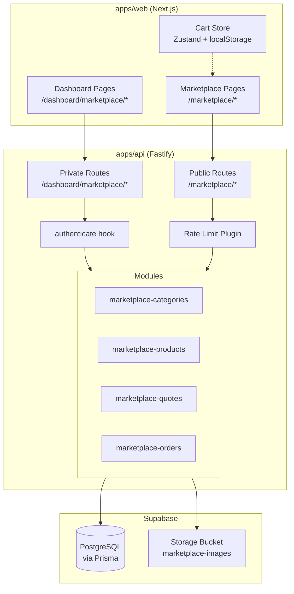

# Design Document: Marketplace Lonas

## Overview

O marketplace de lonas é um módulo de catálogo profissional integrado ao Arte Hub que permite artistas publicarem produtos de lona/cobertura (toldos, capotas, coberturas, lonas industriais) com suporte a dois fluxos de venda: preço fixo (compra direta) e orçamento personalizado (sob medida). O sistema segue a arquitetura existente do Arte Hub — Next.js no frontend (UI only), Fastify no backend (toda lógica de negócio), Prisma/PostgreSQL via Supabase (persistência) e Supabase Storage (imagens).

### Decisões Arquiteturais Chave

1. **Dois fluxos de venda**: `FIXED_PRICE` permite compra direta via carrinho; `QUOTE_ONLY` exige solicitação de orçamento com dimensões customizadas.
2. **Carrinho client-side**: Estado mantido em `localStorage` via Zustand — sem persistência no backend. Validação de estoque ocorre apenas no checkout.
3. **Slug generation**: Transliteração ASCII + hífens, com sufixo numérico sequencial para colisões (ex: `toldo-retratil`, `toldo-retratil-2`).
4. **Rate limiting por endpoint**: Endpoints públicos de criação (quotes, orders) possuem limites mais restritivos que o padrão global.
5. **Ownership isolation**: Todo recurso do marketplace é filtrado por `artistId` extraído do JWT — nunca do body.

---

## Architecture



### Fluxo de Dados

1. **Catálogo público**: Cliente → `GET /marketplace/products` → Service filtra `active=true` → Prisma query → Response com paginação
2. **Orçamento**: Cliente → `POST /marketplace/quotes` → Rate limit check → Validação Zod → Sanitização HTML → Persist com status `PENDING`
3. **Checkout**: Cliente → `POST /marketplace/orders` → Rate limit → Validação de produtos ativos + FIXED_PRICE + estoque → Cálculo de total server-side → Persist
4. **Upload de imagem**: Artista → `POST /dashboard/marketplace/products/:id/images` → Auth → Ownership check → Magic bytes validation → Supabase Storage upload → Persist URL

---

## Components and Interfaces

### Backend Modules

Cada módulo segue o padrão existente: `.routes.ts`, `.controller.ts`, `.service.ts`, `.schemas.ts`, `.repository.ts`.

#### 1. `marketplace-categories` Module

**Routes** (`marketplace-categories.routes.ts`):
```typescript
// Private (authenticated)
POST   /dashboard/marketplace/categories
GET    /dashboard/marketplace/categories
PATCH  /dashboard/marketplace/categories/:id
DELETE /dashboard/marketplace/categories/:id

// Public
GET    /marketplace/categories
```

**Controller** (`marketplace-categories.controller.ts`):
- `createCategoryHandler` — Valida body, gera slug, verifica unicidade, persiste
- `listCategoriesHandler` — Retorna categorias do artista ordenadas por sortOrder
- `updateCategoryHandler` — Ownership check, valida body, regenera slug se name mudou
- `deleteCategoryHandler` — Ownership check, verifica se há produtos vinculados
- `listPublicCategoriesHandler` — Retorna categorias com ao menos 1 produto ativo

**Service** (`marketplace-categories.service.ts`):
- `generateSlug(name: string): string` — Transliteração + hífens
- `ensureUniqueSlug(artistId: string, slug: string, excludeId?: string): Promise<string>`

#### 2. `marketplace-products` Module

**Routes** (`marketplace-products.routes.ts`):
```typescript
// Private (authenticated)
POST   /dashboard/marketplace/products
GET    /dashboard/marketplace/products
GET    /dashboard/marketplace/products/:id
PATCH  /dashboard/marketplace/products/:id
DELETE /dashboard/marketplace/products/:id
POST   /dashboard/marketplace/products/:id/images
PATCH  /dashboard/marketplace/products/:id/images/reorder
DELETE /dashboard/marketplace/products/:id/images/:imageId

// Public
GET    /marketplace/products
GET    /marketplace/products/:slug
```

**Controller** (`marketplace-products.controller.ts`):
- `createProductHandler` — Valida body, sanitiza texto, verifica categoryId ownership, gera slug com sufixo
- `listProductsHandler` — Paginação, retorna produtos do artista
- `getProductHandler` — Ownership check, retorna produto com imagens
- `updateProductHandler` — Ownership check, sanitiza, valida regras de tipo/preço
- `deleteProductHandler` — Ownership check, remove imagens do Storage
- `uploadImageHandler` — Ownership check, valida MIME + tamanho + limite de 10, upload para Storage
- `reorderImagesHandler` — Ownership check, atualiza sortOrder em batch
- `deleteImageHandler` — Ownership check, remove do Storage + DB
- `listPublicProductsHandler` — Filtra active=true, paginação, filtros por category/featured
- `getPublicProductHandler` — Busca por slug, inclui imagens

**Service** (`marketplace-products.service.ts`):
- `generateProductSlug(artistId: string, title: string): Promise<string>`
- `sanitizeText(input: string): string` — Remove tags HTML
- `validateProductType(type: ProductType, basePrice?: number): void`

#### 3. `marketplace-quotes` Module

**Routes** (`marketplace-quotes.routes.ts`):
```typescript
// Public (rate limited: 5 req / 15 min per IP)
POST   /marketplace/quotes

// Private (authenticated)
GET    /dashboard/marketplace/quotes
PATCH  /dashboard/marketplace/quotes/:id/status
```

**Controller** (`marketplace-quotes.controller.ts`):
- `createQuoteHandler` — Rate limit, valida body, sanitiza message, verifica produto ativo, persiste
- `listQuotesHandler` — Filtra por artistId, paginação, filtro por status
- `updateQuoteStatusHandler` — Ownership check, valida transição de status

**Service** (`marketplace-quotes.service.ts`):
- `validateQuoteStatusTransition(current: QuoteStatus, next: QuoteStatus): boolean`
- Transições válidas: `PENDING→ANSWERED`, `PENDING→REJECTED`, `ANSWERED→ACCEPTED`, `ANSWERED→REJECTED`, `PENDING→EXPIRED`

#### 4. `marketplace-orders` Module

**Routes** (`marketplace-orders.routes.ts`):
```typescript
// Public (rate limited: 3 req / 15 min per IP)
POST   /marketplace/orders

// Private (authenticated)
GET    /dashboard/marketplace/orders
PATCH  /dashboard/marketplace/orders/:id/status
```

**Controller** (`marketplace-orders.controller.ts`):
- `createOrderHandler` — Rate limit, valida body, verifica produtos ativos + FIXED_PRICE + mesmo artista + estoque, calcula total server-side
- `listOrdersHandler` — Filtra por artistId, paginação, filtro por status
- `updateOrderStatusHandler` — Ownership check, valida transição de status

**Service** (`marketplace-orders.service.ts`):
- `validateOrderStatusTransition(current: OrderStatus, next: OrderStatus): boolean`
- Transições válidas: `PENDING→CONFIRMED`, `CONFIRMED→SHIPPED`, `SHIPPED→DELIVERED`, `PENDING→CANCELLED`, `CONFIRMED→CANCELLED`
- `calculateOrderTotal(items: OrderItemInput[]): Decimal`

### Frontend Structure

#### Public Pages (`apps/web/src/app/marketplace/`)

```
marketplace/
├── page.tsx                    # Hero + featured products + categories
├── layout.tsx                  # Marketplace layout wrapper
├── category/
│   └── [slug]/
│       └── page.tsx            # Product grid filtered by category
├── product/
│   └── [slug]/
│       └── page.tsx            # Product detail + gallery + action button
├── cart/
│   └── page.tsx                # Cart items + totals
└── checkout/
    └── page.tsx                # Customer form + order summary
```

#### Dashboard Pages (`apps/web/src/app/dashboard/marketplace/`)

```
dashboard/marketplace/
├── page.tsx                    # Overview with metrics
├── layout.tsx                  # Dashboard marketplace layout
├── products/
│   ├── page.tsx                # Product list + search + actions
│   └── [id]/
│       └── page.tsx            # Product form (create/edit)
├── categories/
│   └── page.tsx                # Category list + CRUD
├── quotes/
│   └── page.tsx                # Quote list + status management
└── orders/
    └── page.tsx                # Order list + status management
```

#### Components (`apps/web/src/components/marketplace/`)

```
marketplace/
├── ProductCard.tsx             # Card for product grid
├── ProductGallery.tsx          # Image gallery with thumbnails
├── QuoteModal.tsx              # Quote request form modal
├── CartItem.tsx                # Single cart item row
├── CartSummary.tsx             # Subtotals + total
├── CheckoutForm.tsx            # Customer data form
├── CategoryNav.tsx             # Category navigation/filter
├── PaginationControls.tsx      # Page navigation
└── dashboard/
    ├── ProductForm.tsx         # Create/edit product form
    ├── ImageUploader.tsx       # Drag-and-drop image upload
    ├── CategoryForm.tsx        # Create/edit category form
    ├── QuoteStatusBadge.tsx    # Status badge with color
    ├── OrderStatusBadge.tsx    # Status badge with color
    └── MetricsCard.tsx         # Dashboard metric card
```

#### Cart Store (`apps/web/src/stores/cartStore.ts`)

```typescript
interface CartItem {
  productId: string
  slug: string
  title: string
  unitPrice: number
  quantity: number
  maxStock: number | null
  thumbnailUrl: string | null
}

interface CartStore {
  items: CartItem[]
  addItem: (product: CartProduct) => void
  removeItem: (productId: string) => void
  updateQuantity: (productId: string, quantity: number) => void
  clearCart: () => void
  total: () => number
}
```

---

## Data Models

### Prisma Schema Additions

```prisma
// ── Marketplace Enums ────────────────────────────────────────────────────────

enum ProductType {
  FIXED_PRICE
  QUOTE_ONLY

  @@map("product_type")
}

enum QuoteStatus {
  PENDING
  ANSWERED
  ACCEPTED
  REJECTED
  EXPIRED

  @@map("quote_status")
}

enum OrderStatus {
  PENDING
  CONFIRMED
  SHIPPED
  DELIVERED
  CANCELLED

  @@map("order_status")
}

// ── Marketplace Models ───────────────────────────────────────────────────────

model MarketplaceCategory {
  id        String   @id @default(uuid()) @db.Uuid
  artistId  String   @map("artist_id") @db.Uuid
  name      String   @db.VarChar(100)
  slug      String   @db.VarChar(120)
  icon      String?  @db.VarChar(50)
  sortOrder Int      @default(0) @map("sort_order")
  createdAt DateTime @default(now()) @map("created_at") @db.Timestamptz
  updatedAt DateTime @updatedAt @map("updated_at") @db.Timestamptz

  artist   Artist               @relation(fields: [artistId], references: [id], onDelete: Cascade)
  products MarketplaceProduct[]

  @@unique([artistId, slug], name: "marketplace_category_artist_slug")
  @@index([artistId, sortOrder])
  @@map("marketplace_categories")
}

model MarketplaceProduct {
  id               String      @id @default(uuid()) @db.Uuid
  artistId         String      @map("artist_id") @db.Uuid
  categoryId       String      @map("category_id") @db.Uuid
  title            String      @db.VarChar(150)
  slug             String      @db.VarChar(180)
  description      String?     @db.Text
  shortDescription String?     @map("short_description") @db.VarChar(300)
  type             ProductType
  basePrice        Decimal?    @map("base_price") @db.Decimal(10, 2)
  active           Boolean     @default(false)
  featured         Boolean     @default(false)
  customizable     Boolean     @default(false)
  stock            Int?
  widthCm          Decimal?    @map("width_cm") @db.Decimal(7, 1)
  heightCm         Decimal?    @map("height_cm") @db.Decimal(7, 1)
  material         String?     @db.VarChar(100)
  color            String?     @db.VarChar(50)
  sortOrder        Int         @default(0) @map("sort_order")
  createdAt        DateTime    @default(now()) @map("created_at") @db.Timestamptz
  updatedAt        DateTime    @updatedAt @map("updated_at") @db.Timestamptz

  artist   Artist                    @relation(fields: [artistId], references: [id], onDelete: Cascade)
  category MarketplaceCategory       @relation(fields: [categoryId], references: [id], onDelete: Restrict)
  images   MarketplaceProductImage[]
  quotes   MarketplaceQuoteRequest[]
  orderItems MarketplaceOrderItem[]

  @@unique([artistId, slug], name: "marketplace_product_artist_slug")
  @@index([artistId, active])
  @@index([categoryId])
  @@index([active, sortOrder])
  @@index([active, featured])
  @@map("marketplace_products")
}

model MarketplaceProductImage {
  id        String   @id @default(uuid()) @db.Uuid
  productId String   @map("product_id") @db.Uuid
  url       String   @db.Text
  alt       String?  @db.VarChar(255)
  sortOrder Int      @default(0) @map("sort_order")
  createdAt DateTime @default(now()) @map("created_at") @db.Timestamptz

  product MarketplaceProduct @relation(fields: [productId], references: [id], onDelete: Cascade)

  @@index([productId, sortOrder])
  @@map("marketplace_product_images")
}

model MarketplaceQuoteRequest {
  id              String      @id @default(uuid()) @db.Uuid
  artistId        String      @map("artist_id") @db.Uuid
  productId       String      @map("product_id") @db.Uuid
  requesterName   String      @map("requester_name") @db.VarChar(100)
  requesterEmail  String      @map("requester_email") @db.VarChar(255)
  requesterPhone  String?     @map("requester_phone") @db.VarChar(20)
  message         String      @db.Text
  widthCm         Decimal?    @map("width_cm") @db.Decimal(7, 1)
  heightCm        Decimal?    @map("height_cm") @db.Decimal(7, 1)
  quantity        Int         @default(1)
  status          QuoteStatus @default(PENDING)
  responseMessage String?     @map("response_message") @db.Text
  createdAt       DateTime    @default(now()) @map("created_at") @db.Timestamptz
  updatedAt       DateTime    @updatedAt @map("updated_at") @db.Timestamptz

  artist  Artist             @relation(fields: [artistId], references: [id], onDelete: Cascade)
  product MarketplaceProduct @relation(fields: [productId], references: [id], onDelete: Cascade)

  @@index([artistId, status])
  @@index([artistId, createdAt])
  @@map("marketplace_quote_requests")
}

model MarketplaceOrder {
  id            String      @id @default(uuid()) @db.Uuid
  artistId      String      @map("artist_id") @db.Uuid
  customerName  String      @map("customer_name") @db.VarChar(100)
  customerEmail String      @map("customer_email") @db.VarChar(255)
  customerPhone String?     @map("customer_phone") @db.VarChar(20)
  total         Decimal     @db.Decimal(12, 2)
  status        OrderStatus @default(PENDING)
  createdAt     DateTime    @default(now()) @map("created_at") @db.Timestamptz
  updatedAt     DateTime    @updatedAt @map("updated_at") @db.Timestamptz

  artist Artist                 @relation(fields: [artistId], references: [id], onDelete: Cascade)
  items  MarketplaceOrderItem[]

  @@index([artistId, status])
  @@index([artistId, createdAt])
  @@map("marketplace_orders")
}

model MarketplaceOrderItem {
  id        String  @id @default(uuid()) @db.Uuid
  orderId   String  @map("order_id") @db.Uuid
  productId String  @map("product_id") @db.Uuid
  quantity  Int
  unitPrice Decimal @map("unit_price") @db.Decimal(10, 2)

  order   MarketplaceOrder   @relation(fields: [orderId], references: [id], onDelete: Cascade)
  product MarketplaceProduct @relation(fields: [productId], references: [id], onDelete: Restrict)

  @@index([orderId])
  @@map("marketplace_order_items")
}
```

### Artist Model Update

Add relations to the existing `Artist` model:

```prisma
// Add to Artist model relations:
marketplaceCategories MarketplaceCategory[]
marketplaceProducts   MarketplaceProduct[]
marketplaceQuotes     MarketplaceQuoteRequest[]
marketplaceOrders     MarketplaceOrder[]
```

### Storage Configuration

**Bucket**: `marketplace-images`
- **Access**: Public read (URLs retornadas diretamente), authenticated write
- **Path pattern**: `{artistId}/{productId}/{uuid}.{ext}`
- **Allowed MIME types**: `image/jpeg`, `image/png`, `image/webp`
- **Max file size**: 5 MB
- **Max images per product**: 10

### Slug Generation Algorithm

```typescript
function generateSlug(input: string): string {
  return input
    .normalize('NFD')                          // Decompose accents
    .replace(/[\u0300-\u036f]/g, '')           // Remove diacritics
    .toLowerCase()
    .trim()
    .replace(/[^a-z0-9\s-]/g, '')             // Remove non-alphanumeric
    .replace(/[\s_]+/g, '-')                   // Spaces/underscores → hyphens
    .replace(/-+/g, '-')                       // Collapse multiple hyphens
    .replace(/^-|-$/g, '')                     // Trim leading/trailing hyphens
}

async function ensureUniqueSlug(
  artistId: string,
  baseSlug: string,
  table: 'category' | 'product',
  excludeId?: string,
): Promise<string> {
  let slug = baseSlug
  let suffix = 2
  while (await slugExists(artistId, slug, table, excludeId)) {
    slug = `${baseSlug}-${suffix}`
    suffix++
  }
  return slug
}
```

### HTML Sanitization

```typescript
function sanitizeText(input: string): string {
  return input.replace(/<[^>]+>/g, '')
}
```

Aplicada nos campos: `title`, `description`, `shortDescription` (produtos), `message` (quotes). A validação nos endpoints públicos rejeita inputs que contenham tags HTML (retorna 400), enquanto nos endpoints privados a sanitização é aplicada silenciosamente antes de persistir.

### Rate Limiting Strategy

| Endpoint | Limit | Window | Key |
|----------|-------|--------|-----|
| `POST /marketplace/quotes` | 5 | 15 min | IP |
| `POST /marketplace/orders` | 3 | 15 min | IP |
| `GET /marketplace/*` | 60 | 1 min | IP (global default) |
| `/dashboard/marketplace/*` | 100 | 1 min | IP (dashboard group) |

Implementação via `config.rateLimit` por rota (mesmo padrão do `public-scheduling.routes.ts`):

```typescript
fastify.post('/marketplace/quotes', {
  config: {
    rateLimit: { max: 5, timeWindow: '15 minutes' },
  },
}, createQuoteHandler)
```

### API Request/Response Shapes

#### Categories

**POST /dashboard/marketplace/categories**
```typescript
// Request
{ name: string, icon?: string, sortOrder?: number }

// Response 201
{ data: { id, name, slug, icon, sortOrder, createdAt } }
```

**GET /marketplace/categories**
```typescript
// Response 200
{ data: [{ id, name, slug, icon, sortOrder }] }
```

#### Products

**POST /dashboard/marketplace/products**
```typescript
// Request
{
  title: string, description?: string, shortDescription?: string,
  type: "FIXED_PRICE" | "QUOTE_ONLY", basePrice?: number,
  active?: boolean, featured?: boolean, customizable?: boolean,
  stock?: number, widthCm?: number, heightCm?: number,
  material?: string, color?: string, categoryId: string
}

// Response 201
{ data: { id, title, slug, type, basePrice, active, ... } }
```

**GET /marketplace/products?categoryId=&featured=true&page=1&pageSize=12**
```typescript
// Response 200
{
  data: [{ id, slug, title, description, price, categoryId, featured, sortOrder, thumbnailUrl, createdAt }],
  meta: { total, page, pageSize, totalPages }
}
```

**GET /marketplace/products/:slug**
```typescript
// Response 200
{
  data: {
    id, slug, title, description, shortDescription, type, basePrice,
    customizable, widthCm, heightCm, material, color, categoryId,
    images: [{ id, url, alt, sortOrder }]
  }
}
```

#### Quotes

**POST /marketplace/quotes**
```typescript
// Request
{
  productId: string, requesterName: string, requesterEmail: string,
  requesterPhone?: string, message: string,
  widthCm?: number, heightCm?: number, quantity: number
}

// Response 201
{ data: { id, status: "PENDING", createdAt } }
```

**PATCH /dashboard/marketplace/quotes/:id/status**
```typescript
// Request
{ status: QuoteStatus, responseMessage?: string }

// Response 200
{ data: { id, status, updatedAt } }
```

#### Orders

**POST /marketplace/orders**
```typescript
// Request
{
  customerName: string, customerEmail: string, customerPhone?: string,
  items: [{ productId: string, quantity: number }]
}

// Response 201
{ data: { orderId: string, status: "PENDING", total: number } }
```

**PATCH /dashboard/marketplace/orders/:id/status**
```typescript
// Request
{ status: OrderStatus }

// Response 200
{ data: { id, status, updatedAt } }
```

---


## Correctness Properties

*A property is a characteristic or behavior that should hold true across all valid executions of a system — essentially, a formal statement about what the system should do. Properties serve as the bridge between human-readable specifications and machine-verifiable correctness guarantees.*

### Property 1: Slug generation produces valid ASCII output

*For any* Unicode string input, the `generateSlug` function SHALL produce a string containing only lowercase ASCII letters (`a-z`), digits (`0-9`), and hyphens (`-`), with no leading/trailing hyphens and no consecutive hyphens.

**Validates: Requirements 1.3, 2.2**

### Property 2: Slug uniqueness per artist

*For any* sequence of N items (categories or products) created by the same artist with the same name/title, the generated slugs SHALL all be distinct and follow the pattern `base-slug`, `base-slug-2`, `base-slug-3`, ..., `base-slug-N`.

**Validates: Requirements 1.7, 2.2**

### Property 3: Ownership isolation

*For any* marketplace resource (category, product, quote, order) belonging to artist A, and any authenticated request from artist B (where A ≠ B), the API SHALL return HTTP 403 and not modify the resource.

**Validates: Requirements 1.4, 1.5, 2.4, 2.5, 3.8, 6.9, 9.8, 12.1, 12.3**

### Property 4: Public endpoints only return active resources

*For any* set of marketplace products with varying `active` states, the public listing endpoints SHALL return only products where `active = true`, and the public categories endpoint SHALL return only categories that have at least one product with `active = true`.

**Validates: Requirements 1.10, 4.1, 12.2**

### Property 5: Pagination metadata consistency

*For any* paginated listing with `total` items and requested `pageSize`, the response metadata SHALL satisfy: `totalPages = ceil(total / pageSize)`, `page` is within `[1, totalPages]` (or 1 when total=0), and the number of items returned equals `min(pageSize, total - (page-1) * pageSize)`.

**Validates: Requirements 2.1, 4.3, 4.5, 6.1, 9.1**

### Property 6: FIXED_PRICE requires positive basePrice

*For any* product creation or update where `type = FIXED_PRICE`, if `basePrice` is not provided or is ≤ 0, the API SHALL reject the operation with HTTP 422. Conversely, for `type = QUOTE_ONLY`, `basePrice` is optional.

**Validates: Requirements 2.6**

### Property 7: HTML sanitization removes all tags

*For any* string containing HTML tags (matching pattern `<[^>]+>`), after sanitization the output SHALL contain no substrings matching that pattern, and all non-tag text content SHALL be preserved.

**Validates: Requirements 2.8, 5.8, 12.4**

### Property 8: MIME validation by magic bytes

*For any* file buffer, the MIME type detected by magic bytes inspection SHALL match the declared MIME type for the upload to be accepted. Only `image/jpeg`, `image/png`, and `image/webp` SHALL be accepted, and files exceeding 5 MB SHALL be rejected.

**Validates: Requirements 3.2, 3.3, 12.5**

### Property 9: Quote status transition validity

*For any* MarketplaceQuoteRequest with current status S and requested transition to status T, the transition SHALL succeed only if (S, T) is in the set {(PENDING, ANSWERED), (PENDING, REJECTED), (ANSWERED, ACCEPTED), (ANSWERED, REJECTED), (PENDING, EXPIRED)}. Additionally, when T = ANSWERED, `responseMessage` SHALL be required.

**Validates: Requirements 6.5, 6.6, 6.7**

### Property 10: Order status transition validity

*For any* MarketplaceOrder with current status S and requested transition to status T, the transition SHALL succeed only if (S, T) is in the set {(PENDING, CONFIRMED), (CONFIRMED, SHIPPED), (SHIPPED, DELIVERED), (PENDING, CANCELLED), (CONFIRMED, CANCELLED)}.

**Validates: Requirements 9.5, 9.6, 9.7**

### Property 11: Cart only accepts FIXED_PRICE products

*For any* product, the cart store SHALL accept addition only when `type = FIXED_PRICE` and `basePrice > 0`. For any other product type or missing/zero basePrice, the addition SHALL be rejected.

**Validates: Requirements 7.2, 7.3**

### Property 12: Cart quantity bounds respect stock

*For any* cart item, the quantity SHALL be clamped to the range `[1, min(99, stock)]` when `stock` is defined, or `[1, 99]` when `stock` is null. Setting quantity outside this range SHALL result in clamping to the nearest bound.

**Validates: Requirements 7.4, 7.7**

### Property 13: Cart total equals sum of item subtotals

*For any* cart state with N items, the total SHALL equal the sum of `quantity × unitPrice` for each item, computed with 2 decimal places precision.

**Validates: Requirements 7.6**

### Property 14: Order total calculated server-side

*For any* valid order submission, the persisted `total` SHALL equal the sum of `quantity × product.basePrice` for each item in the order, regardless of any total value sent by the client.

**Validates: Requirements 8.4, 8.5**

### Property 15: Order items must belong to same artist

*For any* order submission where the items reference products belonging to different artists, the API SHALL reject the order with HTTP 422. For valid orders, the `artistId` on the order SHALL equal the `artistId` of all referenced products.

**Validates: Requirements 8.8, 8.9**

### Property 16: Order stock validation

*For any* order item where the referenced product has `stock` defined and the requested `quantity` exceeds `stock`, the API SHALL reject the order with HTTP 422.

**Validates: Requirements 8.10**

### Property 17: Listing ordering invariant

*For any* listing response, the items SHALL be ordered according to the endpoint's specified criteria: categories by `sortOrder` ASC; products by `sortOrder` ASC then `createdAt` DESC; quotes by `createdAt` DESC; orders by `createdAt` DESC.

**Validates: Requirements 1.9, 4.9, 6.2, 9.4**

---

## Error Handling

### HTTP Status Code Strategy

| Code | Usage |
|------|-------|
| 200 | Successful read/update |
| 201 | Successful creation |
| 204 | Successful deletion |
| 400 | Invalid pagination params, malformed request body |
| 401 | Missing/expired/invalid JWT |
| 403 | Ownership violation, insufficient permissions |
| 404 | Resource not found |
| 409 | Slug conflict (duplicate category name) |
| 422 | Business rule violation (invalid type/price combo, invalid status transition, stock exceeded, products from different artists, category has products) |
| 429 | Rate limit exceeded |

### Error Response Format

All error responses follow the existing pattern:

```typescript
// Simple error
{ error: string }

// Validation error (Zod)
{ error: string, details: { fieldErrors: Record<string, string[]>, formErrors: string[] } }

// Rate limit error
{ error: string, retryAfter: number } // seconds until next window
```

### Business Rule Errors

| Scenario | Code | Message |
|----------|------|---------|
| Delete category with products | 422 | "Categoria possui produtos vinculados" |
| FIXED_PRICE without basePrice | 422 | "Preço base é obrigatório para produtos com preço fixo" |
| Invalid status transition | 422 | "Transição de status inválida: {current} → {requested}" |
| Products from different artists | 422 | "Todos os itens devem pertencer ao mesmo artista" |
| Stock exceeded | 422 | "Quantidade excede o estoque disponível para {productTitle}" |
| Image limit reached | 422 | "Limite máximo de 10 imagens por produto atingido" |
| Slug conflict | 409 | "Já existe uma categoria com este nome" |
| Product inactive for quote | 422 | "Produto não encontrado ou inativo" |
| ANSWERED without responseMessage | 422 | "Mensagem de resposta é obrigatória ao responder orçamento" |

### Graceful Degradation

- **Storage failures**: If Supabase Storage upload fails, the API returns 500 with generic error. The DB record is not created (transaction rollback).
- **Storage delete failures**: If file deletion from Storage fails during image removal, log the error but still remove the DB record. Orphaned files are acceptable (can be cleaned by a future cron job).
- **Prisma unique constraint violations**: Caught and mapped to 409 for slug conflicts.

---

## Testing Strategy

### Property-Based Testing (PBT)

This feature is well-suited for property-based testing because it contains:
- Pure functions (slug generation, sanitization, total calculation)
- State machine logic (status transitions)
- Universal invariants (ownership, pagination, ordering)
- Input validation with wide input spaces

**Library**: `fast-check` (already in devDependencies)
**Minimum iterations**: 100 per property test
**Tag format**: `Feature: marketplace-lonas, Property {N}: {title}`

#### PBT Test Files

| File | Properties Covered |
|------|-------------------|
| `marketplace-products.slug.property.test.ts` | Property 1, 2 |
| `marketplace-products.ownership.property.test.ts` | Property 3 |
| `marketplace-products.visibility.property.test.ts` | Property 4 |
| `marketplace-products.pagination.property.test.ts` | Property 5 |
| `marketplace-products.validation.property.test.ts` | Property 6, 7, 8 |
| `marketplace-quotes.transitions.property.test.ts` | Property 9 |
| `marketplace-orders.transitions.property.test.ts` | Property 10 |
| `marketplace-orders.calculation.property.test.ts` | Property 14, 15, 16 |
| `cart-store.property.test.ts` (frontend) | Property 11, 12, 13 |
| `marketplace-listing.ordering.property.test.ts` | Property 17 |

### Unit Tests (Example-Based)

Focus on specific scenarios not covered by PBT:
- 404 for non-existent resources
- 401 for missing/invalid JWT
- Delete category with products → 422
- Empty listing returns 200 with empty array
- Rate limit integration (5 req / 15 min)
- Image upload with exactly 10 images → reject 11th
- File size at boundary (5 MB)

### Integration Tests

- Full CRUD flow for categories, products
- Quote creation → status update flow
- Order creation → status update flow
- Image upload → Storage verification
- Rate limiting behavior verification

### Test Organization

```
apps/api/src/modules/
├── marketplace-categories/
│   ├── marketplace-categories.controller.test.ts      # Unit tests
│   └── marketplace-categories.ownership.property.test.ts
├── marketplace-products/
│   ├── marketplace-products.controller.test.ts        # Unit tests
│   ├── marketplace-products.slug.property.test.ts
│   ├── marketplace-products.ownership.property.test.ts
│   ├── marketplace-products.visibility.property.test.ts
│   ├── marketplace-products.pagination.property.test.ts
│   └── marketplace-products.validation.property.test.ts
├── marketplace-quotes/
│   ├── marketplace-quotes.controller.test.ts          # Unit tests
│   └── marketplace-quotes.transitions.property.test.ts
└── marketplace-orders/
    ├── marketplace-orders.controller.test.ts          # Unit tests
    ├── marketplace-orders.transitions.property.test.ts
    └── marketplace-orders.calculation.property.test.ts

apps/web/src/stores/
└── cart-store.property.test.ts
```
