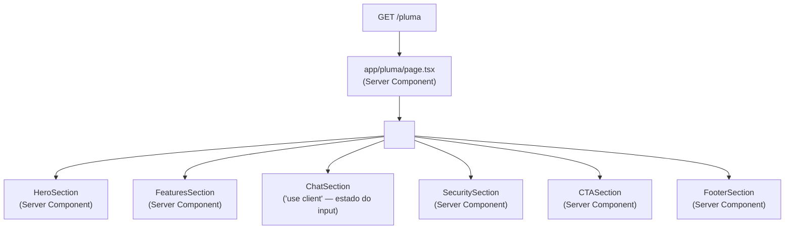

# Design Document — Pluma Landing Page

## Overview

A página Pluma é uma landing page estática para o produto **Pluma** — um assistente financeiro com IA voltado ao mercado brasileiro. A página é servida na rota `/pluma` do Next.js 14 App Router, completamente isolada do sistema de perfis de artistas existente.

### Objetivos de Design

- **Isolamento total**: nenhum componente, estilo ou dado compartilhado com os perfis `musician` ou `tattoo`
- **Zero dependências novas**: apenas Next.js 14, Tailwind CSS 3 e TypeScript
- **Identidade visual própria**: paleta verde-escuro/teal/creme/preto com tipografia editorial oversized
- **Acessibilidade WCAG 2.1 AA**: contraste, foco visível, semântica HTML e atributos ARIA
- **Performance estática**: sem chamadas a APIs, banco de dados ou sistema de arquivos em runtime

### Decisões Técnicas Chave

| Decisão | Escolha | Justificativa |
|---|---|---|
| Tipografia heading | Anton via `next/font/google` | Disponível no Google Fonts, carregamento otimizado pelo Next.js, sem dependência nova |
| Tipografia body | Inter (já carregada em globals.css) | Reutiliza o import existente, sem custo adicional |
| Animações | CSS transitions + Tailwind classes | Requisito explícito: sem Framer Motion |
| Ícones | SVG inline como componentes React | Requisito explícito: sem lucide-react ou similar |
| Mockup visual | `<div>` estilizado com gradiente Tailwind | Requisito explícito: sem URLs de imagens externas |
| Fundo do body | Override local via className no `<main>` | globals.css define `body { background: #0a0a0f }` — a página Pluma usa fundo branco/colorido por seção, então cada seção define seu próprio background |
| Rota | `apps/web/src/app/pluma/page.tsx` (arquivo estático) | Rota estática tem precedência sobre `[slug]/page.tsx` no App Router |
| Font loading | `next/font/google` com `display: 'swap'` | Evita FOUT, sem adicionar `<link>` manual ao `<head>` |

---

## Architecture

### Estrutura de Arquivos

```
apps/web/src/
├── app/
│   └── pluma/
│       └── page.tsx                    ← Pluma_Page (rota estática)
└── components/
    └── pluma/
        ├── PlumaLayout.tsx             ← Pluma_Layout (orquestrador)
        ├── HeroSection.tsx             ← Hero_Section
        ├── FeaturesSection.tsx         ← Features_Section
        ├── ChatSection.tsx             ← Chat_Section (com estado React)
        ├── SecuritySection.tsx         ← Security_Section
        ├── CTASection.tsx              ← CTA_Section
        ├── FooterSection.tsx           ← Footer_Section
        └── icons/
            ├── LandmarkIcon.tsx        ← SVG inline: banco/finanças
            ├── WalletIcon.tsx          ← SVG inline: carteira
            ├── MessageCircleIcon.tsx   ← SVG inline: conversa com IA
            └── CheckIcon.tsx          ← SVG inline: check de segurança
```

### Fluxo de Renderização



`ChatSection` é o único componente que requer `'use client'` devido ao estado do campo de input (preenchimento via Prompt_Pill). Todos os demais são Server Components puros.

### Isolamento de Rotas

O App Router do Next.js 14 resolve rotas estáticas antes de rotas dinâmicas. A rota `/pluma` (arquivo `app/pluma/page.tsx`) tem precedência sobre `app/[slug]/page.tsx`, portanto não há conflito de roteamento e nenhuma alteração no middleware é necessária.

---

## Components and Interfaces

### `PlumaLayout`

```typescript
// apps/web/src/components/pluma/PlumaLayout.tsx
// Server Component — sem props externas

export function PlumaLayout(): JSX.Element
```

Orquestra as seis seções em sequência. Não recebe props — todos os dados são estáticos e definidos dentro de cada componente de seção.

---

### `HeroSection`

```typescript
// Server Component — sem props
export function HeroSection(): JSX.Element
```

**Estrutura DOM:**
```
<section id="hero" className="bg-white ...">
  <div className="max-w-7xl mx-auto px-4 sm:px-6 lg:px-8 py-20 lg:py-32">
    <div className="grid grid-cols-1 md:grid-cols-2 gap-12 items-center">
      <!-- Coluna esquerda: copy -->
      <div>
        <p className="eyebrow ...">ASSISTENTE FINANCEIRO COM IA</p>
        <h1 className="font-anton text-5xl md:text-7xl lg:text-8xl ...">...</h1>
        <p className="subtitle text-base md:text-lg ...">...</p>
        <a href="/register" className="cta-button ...">Teste grátis por 14 dias</a>
      </div>
      <!-- Coluna direita: mockup -->
      <div aria-hidden="true" className="product-mockup ...">
        <!-- div estilizado com gradiente -->
      </div>
    </div>
  </div>
</section>
```

**Paleta aplicada:** fundo `#FFFFFF`, texto `#050706`, botão CTA `bg-[#1C3F3A] text-white`

---

### `FeaturesSection`

```typescript
// Server Component — sem props
export function FeaturesSection(): JSX.Element

// Dados estáticos internos:
const FEATURES = [
  {
    icon: <LandmarkIcon />,
    title: "Conecta automaticamente",
    description: "Conecta automaticamente todas suas contas via Open Finance do Banco Central."
  },
  {
    icon: <WalletIcon />,
    title: "Experiência personalizada",
    description: "Responde suas dúvidas em linguagem humana e sugere ações para sua situação real."
  },
  {
    icon: <MessageCircleIcon />,
    title: "Atualiza sozinho",
    description: "Não precisa fazer input manual. Você só conversa e toma decisões."
  }
]
```

**Layout:** `grid-cols-1 md:grid-cols-2 lg:grid-cols-3`

**Hover:** `hover:-translate-y-1 transition-transform duration-200` (equivale a 4px com `translate-y-1 = 4px` no Tailwind)

---

### `ChatSection`

```typescript
// 'use client' — gerencia estado do input
'use client'

export function ChatSection(): JSX.Element

// Dados estáticos internos:
const PROMPT_PILLS = [
  "Quanto posso gastar neste fim de semana?",
  "Por que minha conta está sempre no vermelho?",
  "Consigo trocar de carro este ano?",
  "Onde estou gastando demais?",
  "Quanto preciso guardar para a reserva de emergência?"
]
```

**Estado:**
```typescript
const [inputValue, setInputValue] = useState('')

// Handler para Prompt_Pill:
const handlePillClick = (text: string) => setInputValue(text)
```

**Paleta aplicada:** fundo `#1C3F3A`, texto `#EBE8D8`

**Prompt_Pill hover:** `hover:bg-[#2E8F86] transition-colors duration-200`

---

### `SecuritySection`

```typescript
// Server Component — sem props
export function SecuritySection(): JSX.Element

// Dados estáticos internos:
const SECURITY_ITEMS = [
  {
    title: "Open Finance certificado pelo Banco Central",
    description: "Integração oficial com o ecossistema Open Finance regulado pelo Banco Central do Brasil."
  },
  {
    title: "Mesma segurança que seu internet banking",
    description: "Protocolos de segurança bancária com autenticação de múltiplos fatores."
  },
  {
    title: "Seus dados nunca saem do Brasil",
    description: "Infraestrutura 100% nacional. Seus dados financeiros ficam em servidores no Brasil."
  },
  {
    title: "Criptografia de ponta a ponta",
    description: "Todas as comunicações são criptografadas com TLS 1.3 e chaves gerenciadas localmente."
  }
]
```

**Layout:** `grid-cols-1 md:grid-cols-2`

**Paleta aplicada:** fundo `#EBE8D8`, texto `#050706`, borda `border border-[rgba(28,63,58,0.16)]`

---

### `CTASection`

```typescript
// Server Component — sem props
export function CTASection(): JSX.Element

// Dados estáticos internos:
const BENEFITS = [
  "✓ 14 dias grátis, sem cartão de crédito",
  "✓ Conecta com mais de 200 bancos via Open Finance",
  "✓ Cancele quando quiser, sem burocracia"
]
```

**Paleta aplicada:** fundo `#1C3F3A`, texto `#FFFFFF`, botão `bg-[#2E8F86] hover:bg-[#1C3F3A]`

**Botão hover:** `hover:bg-[#1C3F3A] transition-colors duration-300`

---

### `FooterSection`

```typescript
// Server Component — sem props
export function FooterSection(): JSX.Element

// Dados estáticos internos:
const NAV_SECTIONS = [
  { label: "Início",         href: "#hero" },
  { label: "Por que Pluma",  href: "#features" },
  { label: "Pluma Answers",  href: "#chat" },
  { label: "Segurança",      href: "#security" },
  { label: "Experimente",    href: "#cta" }
]

const LEGAL_LINKS = [
  { label: "Política de Privacidade", href: "/pluma/privacidade" },
  { label: "Termos de Uso",           href: "/pluma/termos" }
]
```

**Paleta aplicada:** fundo `#050706`, texto `#EBE8D8`

---

### Componentes de Ícone SVG

Cada ícone é um componente React que retorna um `<svg>` inline com `aria-hidden="true"` (decorativo) ou `aria-label` quando usado de forma independente.

```typescript
// Exemplo: LandmarkIcon
interface IconProps {
  className?: string
  'aria-hidden'?: boolean | 'true' | 'false'
}

export function LandmarkIcon({ className, ...props }: IconProps): JSX.Element {
  return (
    <svg
      xmlns="http://www.w3.org/2000/svg"
      viewBox="0 0 24 24"
      fill="none"
      stroke="currentColor"
      strokeWidth={2}
      strokeLinecap="round"
      strokeLinejoin="round"
      className={className}
      aria-hidden="true"
      {...props}
    >
      {/* paths do ícone Landmark */}
    </svg>
  )
}
```

---

## Data Models

Esta feature não possui modelos de dados dinâmicos. Todos os dados são constantes estáticas definidas dentro de cada componente de seção. Não há integração com banco de dados, API ou sistema de arquivos.

### Constantes de Paleta

```typescript
// Definidas como valores Tailwind arbitrários inline — não adicionadas ao tailwind.config.ts
// para evitar poluir a configuração global do projeto

const PLUMA_COLORS = {
  darkGreen: '#1C3F3A',  // bg-[#1C3F3A]
  teal:      '#2E8F86',  // bg-[#2E8F86]
  cream:     '#EBE8D8',  // bg-[#EBE8D8]
  black:     '#050706',  // bg-[#050706]
  white:     '#FFFFFF',  // bg-white
} as const
```

### Tipografia

```typescript
// apps/web/src/app/pluma/page.tsx
import { Anton } from 'next/font/google'

const anton = Anton({
  weight: '400',
  subsets: ['latin'],
  display: 'swap',
  variable: '--font-anton',
})
```

A variável CSS `--font-anton` é passada via `className` ao `<main>` e usada nos headings com `font-[family-name:var(--font-anton)]` ou via classe utilitária Tailwind.

---

## Correctness Properties

*A property is a characteristic or behavior that should hold true across all valid executions of a system — essentially, a formal statement about what the system should do. Properties serve as the bridge between human-readable specifications and machine-verifiable correctness guarantees.*

Esta feature é uma landing page estática com um único componente interativo (ChatSection). A maioria dos requisitos são verificados por testes de exemplo (conteúdo estático, classes CSS, estrutura DOM). As propriedades abaixo cobrem os requisitos que se aplicam universalmente a conjuntos de elementos — onde a verificação de "todos os itens satisfazem a condição" é mais valiosa do que um único exemplo.

---

### Property 1: Prompt Pill Click Fills Input

*For any* Prompt_Pill in the ChatSection, clicking that pill SHALL set the input field value to exactly the text content of that pill.

**Validates: Requirements 5.6**

---

### Property 2: Security Card Content Length Invariant

*For any* security card in the SecuritySection data array, the card's title SHALL have at most 60 characters AND the card's description SHALL have at most 120 characters.

**Validates: Requirements 6.2**

---

### Property 3: CTA Benefit List Invariant

*For any* rendering of the CTASection, the benefit items list SHALL contain at least 3 items AND every item in the list SHALL be preceded by the "✓" marker character.

**Validates: Requirements 7.3**

---

### Property 4: Footer Navigation Completeness

*For any* section defined in the FooterSection navigation data array, a corresponding anchor link (`<a>` element with matching `href`) SHALL exist in the rendered footer DOM.

**Validates: Requirements 8.3**

---

### Property 5: External Links Security Attributes

*For any* external link rendered in the FooterSection (Política de Privacidade, Termos de Uso), the link element SHALL have `target="_blank"` AND `rel="noopener noreferrer"` attributes.

**Validates: Requirements 8.4**

---

### Property 6: WCAG Color Contrast Compliance

*For any* text/background color pair used in the Pluma page, the WCAG 2.1 contrast ratio SHALL meet the required threshold:
- Normal text (< 18px regular, < 14px bold): contrast ratio ≥ 4.5:1
- Large text (≥ 18px regular or ≥ 14px bold): contrast ratio ≥ 3:1
- Focus outlines against adjacent background: contrast ratio ≥ 3:1

Color pairs to verify:
- `#050706` on `#EBE8D8` (Security section text on cream) → must be ≥ 4.5:1
- `#EBE8D8` on `#050706` (Footer text on black) → must be ≥ 4.5:1
- `#FFFFFF` on `#1C3F3A` (CTA/Chat text on dark green) → must be ≥ 4.5:1
- Focus outline color on adjacent background → must be ≥ 3:1

**Validates: Requirements 6.4, 7.6, 8.5**

---

### Property 7: Semantic HTML Structure

*For any* rendering of the PlumaLayout, the DOM SHALL contain at least one instance of each required semantic element: `<main>`, `<section>`, `<footer>`, `<h1>`, `<h2>`, `<nav>`, `<ul>`, `<li>`.

**Validates: Requirements 9.3**

---

### Property 8: Interactive Element Keyboard Accessibility

*For any* interactive element (button, anchor link, Prompt_Pill) rendered in the Pluma page, the element SHALL have a visible focus indicator implemented via CSS `focus-visible` styles with a contrast ratio of at least 3:1 against the adjacent background.

**Validates: Requirements 9.4, 3.8, 7.6**

---

### Property 9: Decorative Element Accessibility

*For any* decorative image or SVG element rendered in the Pluma page (Product_Mockup, icon SVGs used decoratively), the element SHALL have either `alt=""` (for ``) or `aria-hidden="true"` (for `<svg>` and decorative `<div>` wrappers with role).

**Validates: Requirements 9.5**

---

### Property 10: Icon-Only Interactive Element Labeling

*For any* interactive element in the Pluma page that does not contain visible text content, the element SHALL have a non-empty `aria-label` attribute that describes its action.

**Validates: Requirements 9.6**

---

## Error Handling

Esta é uma página estática sem chamadas a APIs ou operações assíncronas em runtime. Os cenários de erro relevantes são:

### Build-Time Errors

| Cenário | Tratamento |
|---|---|
| Erro de TypeScript em componente Pluma | O build falha com mensagem clara — nenhum fallback necessário |
| Fonte Anton não carregada (Google Fonts indisponível) | `next/font` usa `display: 'swap'` — o browser renderiza com fonte fallback (`sans-serif`) até a fonte carregar |
| Classe Tailwind arbitrária inválida | O build do Tailwind ignora classes inválidas silenciosamente — usar apenas valores hex válidos |

### Runtime (Client-Side)

| Cenário | Tratamento |
|---|---|
| JavaScript desabilitado no browser | ChatSection usa `useState` — sem JS, o input funciona como campo HTML nativo mas as pills não preenchem o input. Isso é aceitável: a página é legível e navegável sem JS |
| Scroll suave não suportado | `scroll-behavior: smooth` já está em globals.css — fallback automático para scroll instantâneo em browsers sem suporte |

### Acessibilidade

| Cenário | Tratamento |
|---|---|
| Leitor de tela em SVG decorativo | `aria-hidden="true"` em todos os SVGs decorativos — o leitor de tela os ignora |
| Navegação por teclado em Prompt_Pills | Pills implementadas como `<button>` — recebem foco nativo, ativadas por Enter/Space |

---

## Testing Strategy

### Abordagem Dual

A estratégia combina testes de exemplo (para comportamentos específicos e conteúdo estático) com testes de propriedade (para invariantes universais sobre conjuntos de elementos).

**PBT é aplicável** a esta feature de forma limitada: o único componente com lógica de estado é `ChatSection` (Property 1), e as demais propriedades verificam invariantes sobre arrays de dados estáticos e atributos DOM. A biblioteca escolhida é **Vitest** (já instalada) com **@fast-check/vitest** para as propriedades que envolvem geração de dados.

> **Nota**: Para as propriedades sobre dados estáticos (Properties 2–10), a "geração de inputs" é sobre os próprios arrays de dados definidos no componente — não sobre inputs aleatórios externos. Isso torna os testes determinísticos mas ainda expressivos como propriedades universais.

### Testes de Exemplo (Vitest)

Localização: `apps/web/src/components/pluma/__tests__/`

```
__tests__/
├── HeroSection.test.tsx
├── FeaturesSection.test.tsx
├── ChatSection.test.tsx
├── SecuritySection.test.tsx
├── CTASection.test.tsx
├── FooterSection.test.tsx
└── PlumaPage.test.tsx
```

**Cobertura por componente:**

- **PlumaPage**: metadata title/description, renderização do `<main>`, ausência de imports proibidos
- **HeroSection**: eyebrow text, h1 presente, botão CTA com texto correto, classes de layout responsivo
- **FeaturesSection**: exatamente 3 cards, textos exatos de título e descrição, classes de hover
- **ChatSection**: 5 pills com textos corretos, placeholder length, click handler (Property 1)
- **SecuritySection**: 4 cards, textos de segurança presentes, classes de layout
- **CTASection**: h2 presente, lista de benefícios, botão CTA, classes de hover/transition
- **FooterSection**: "Pluma" presente, links de navegação, links legais com atributos corretos

### Testes de Propriedade (Vitest)

Localização: `apps/web/src/components/pluma/__tests__/pluma.property.test.tsx`

**Configuração:** mínimo 100 iterações por propriedade (configurado via `fc.configureGlobal({ numRuns: 100 })`)

**Tag format:** `// Feature: pluma-landing-page, Property {N}: {property_text}`

```typescript
// Exemplo de estrutura:
import { describe, it, expect } from 'vitest'
import fc from 'fast-check'

describe('Pluma Landing Page — Correctness Properties', () => {
  
  // Feature: pluma-landing-page, Property 1: Prompt pill click fills input
  it('Property 1: clicking any prompt pill fills the input with that pill text', () => {
    // Testa sobre o array estático de PROMPT_PILLS
    // Para cada pill, simula click e verifica inputValue === pill.text
  })

  // Feature: pluma-landing-page, Property 2: Security card content length invariant
  it('Property 2: every security card title ≤ 60 chars and description ≤ 120 chars', () => {
    // Itera sobre SECURITY_ITEMS e verifica constraints de comprimento
  })

  // Feature: pluma-landing-page, Property 3: CTA benefit list invariant
  it('Property 3: benefit list has ≥ 3 items and every item starts with ✓', () => {
    // Verifica BENEFITS array
  })

  // Feature: pluma-landing-page, Property 4: Footer navigation completeness
  it('Property 4: every nav section has a corresponding link in the footer', () => {
    // Para cada item em NAV_SECTIONS, verifica link no DOM renderizado
  })

  // Feature: pluma-landing-page, Property 5: External links security attributes
  it('Property 5: every legal link has target=_blank and rel=noopener noreferrer', () => {
    // Para cada item em LEGAL_LINKS, verifica atributos
  })

  // Feature: pluma-landing-page, Property 6: WCAG color contrast compliance
  it('Property 6: all color pairs meet WCAG 2.1 AA contrast requirements', () => {
    // Verifica cada par de cores com a fórmula de contraste WCAG
    // Não requer fast-check — é determinístico sobre pares fixos
  })

  // Feature: pluma-landing-page, Property 7: Semantic HTML structure
  it('Property 7: rendered layout contains all required semantic elements', () => {
    // Renderiza PlumaLayout e verifica presença de cada elemento semântico
  })

  // Feature: pluma-landing-page, Property 8: Interactive element keyboard accessibility
  it('Property 8: every interactive element has focus-visible styles', () => {
    // Queries todos os button e a elements, verifica classes focus-visible
  })

  // Feature: pluma-landing-page, Property 9: Decorative element accessibility
  it('Property 9: every decorative SVG has aria-hidden=true', () => {
    // Queries todos os SVGs decorativos, verifica aria-hidden
  })

  // Feature: pluma-landing-page, Property 10: Icon-only elements have aria-label
  it('Property 10: every icon-only interactive element has aria-label', () => {
    // Queries elementos interativos sem texto visível, verifica aria-label
  })
})
```

### Smoke Tests (Build)

- `next build` sem erros de TypeScript ou build
- Grep de imports proibidos em `components/pluma/`
- Grep de `innerHTML` / `dangerouslySetInnerHTML` em `components/pluma/`
- Grep de `framer-motion` em `components/pluma/`

### Notas sobre WCAG Contrast (Property 6)

A fórmula de contraste WCAG é determinística e pode ser implementada como função pura:

```typescript
function relativeLuminance(hex: string): number {
  const rgb = hexToRgb(hex)
  const [r, g, b] = rgb.map(c => {
    const s = c / 255
    return s <= 0.03928 ? s / 12.92 : Math.pow((s + 0.055) / 1.055, 2.4)
  })
  return 0.2126 * r + 0.7152 * g + 0.0722 * b
}

function contrastRatio(hex1: string, hex2: string): number {
  const l1 = relativeLuminance(hex1)
  const l2 = relativeLuminance(hex2)
  const lighter = Math.max(l1, l2)
  const darker  = Math.min(l1, l2)
  return (lighter + 0.05) / (darker + 0.05)
}
```

Pares verificados e seus ratios esperados:
- `#050706` on `#EBE8D8`: ~14.5:1 ✓ (muito acima de 4.5:1)
- `#EBE8D8` on `#050706`: ~14.5:1 ✓
- `#FFFFFF` on `#1C3F3A`: ~8.2:1 ✓
- `#FFFFFF` on `#2E8F86`: ~3.1:1 ✓ (acima de 3:1 para texto grande/botão)

> **Nota WCAG**: Full validation requires manual testing with assistive technologies and expert accessibility review. The contrast ratio calculations above are mathematical verifications of the color pairs — they do not replace testing with screen readers or other assistive technologies.
